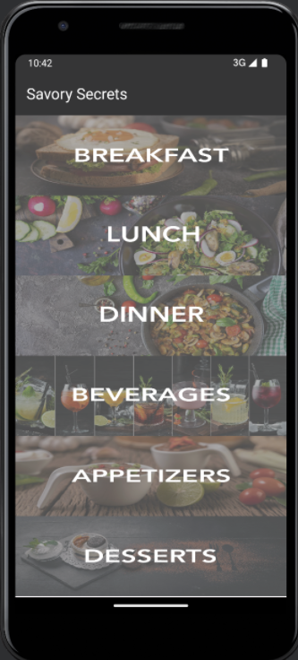

# Savory Secrets
## Description
The Savory Secrets app is a user-friendly digital recipe book that lets users store recipes by 
category. Users can easily add, edit, delete, and search within each category, making recipe 
organization a breeze.  

## Functionality
### Add Recipes:
   * With the "Add" function, users can store their favorite recipes. Users are able to 
input the dish name, list the ingredients, and provide step-by-step cooking instructions within a 
category. 
### Edit Recipes:
   * The "Edit" function allows users to edit their recipes whenever needed.  
### Delete Recipes:
   * If users no longer need a particular recipe in the collection, the "Delete" 
function allows to remove unwanted recipes. 
### Categorize Recipes:
   * The app lets users categorize recipes under various categories like 
'Breakfast', 'Lunch', 'Dinner', 'Beverages', 'Appetizers', and 'Desserts'.  
### Search Recipes:
   * The app's "Search" function allows users to find recipes within different 
categories.
## Third Party Libraries 
* AndroidX Libraries: This library acts as an improved iteration of the original Android Support 
Library. It plays a role in ensuring backward compatibility while still giving additional features, 
allowing our application to function across a wider range of Android versions. 
* Material Components for Android: It offers us a variety of UI components stick to the design 
system and facilitates the creation of an appealing interface. 
* Navigation Component: This library guides the implementation of navigation within the 
application. It streamlines the transition between different fragments and user interfaces in the 
application. 
* RecyclerView: RecyclerView is for displaying a large number of similar items on the screen. It is 
used in our app to show recipes.  
* ViewModel and LiveData: These are part of the Android Architecture libraries and they play a 
key role in our app's stability and maintenance. They manage UI data in a way that's aware of 
the app's lifecycle. LiveData keeps data consistent even when the app goes through changes, 
like rotation. ViewModel is like a storage area that holds and manages UI-related data for us. 
* Room Database: This is what we use to handle all the app's database tasks. Room helps us with 
various tasks like creating, reading, updating, and deleting recipes (CRUD operations), and it 
ensures our app's data is well-organized and easy to work with.
